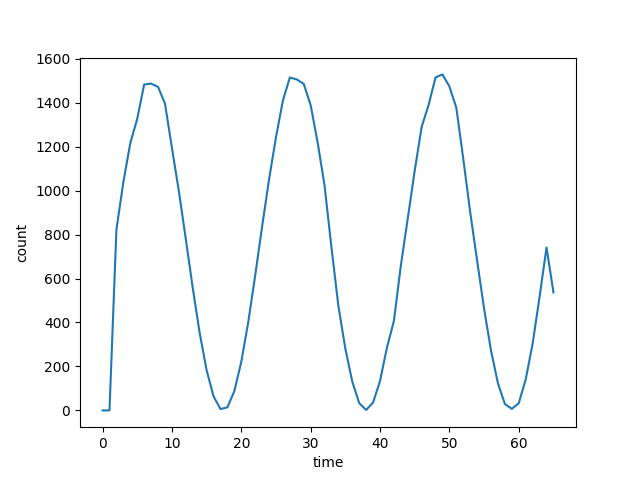
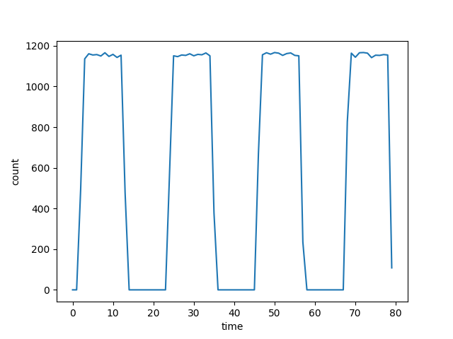

# 实现方法

该项目之前的某次提交，实现了一个多线程的客户端与服务器，但是展现出来的结果非常糟糕，基本看不出设想的波形，因此在答疑的过程中，作者向老师求助，老师说多线程是比较难控制的，而且该任务中不需要将网卡塞满，所以只需要但线程就好了。所以该项目目前就是单线程的代码了（客户端虽然是多线程，但是发送还是单线程），会在后续的代码中考虑加入多线程发送的功能。

## 系统设计

该系统分为服务器、客户端以及绘图脚本三部分构成。

服务器部分，接收来自客户端的报文，一旦接收到报文，则获取当前系统时间，精确到微秒，并记录到redis数据库中。

客户端部分，由两个线程构成，一个线程用于等待信号量发送报文，另一个线程用于发送信号量。每隔n微秒就根据当前情况发送一次信号量或者不发送，如此执行m次，称为一个时间片，只需要控制在时间片内发送报文的数量，即控制m次中需要发包的次数m'的大小，就可以从整体上控制波形；而只需要控制间隔n的大小，就可以控制所绘制流量图的幅度。因此，只需要按照函数来控制m'，且不要让n太小以至于丢包太多，就可以很好地绘制出波形。在<code>config.h</code>配置中，n的大小为<code>SEND_INTERVAL</code>，m的大小为<code>MAX_SEND_PACKET_PER_SLICE</code>

绘制脚本部分，从数据库中读出数据，并进行统计，最终绘制成折线图或者柱状图，就可以很清晰地看到波形了

## 前期测试

首先，编写了一个单线程测试程序，测试程序中让该线程向一个地址不间断地发送UDP报文，检测发送一个报文平均消耗的时间。经过统计，大约是20微秒，那么发包速率基本是50k Packet/s，这个速率非常大，远远没有这个必要，因此发包间隔预设为100微秒，100次为一个时间片，这样完成一个函数的周期就会快很多。

这里其实有点小问题，就是没有测接收需要多长时间，即从收到报文到处理完接收任务需要多长时间，这个时间也不好测试，因为接收到报文的时间没办法获取，因此这里设置为100微秒发送一次报文就是防止出现接收的性能瓶颈问题从而影响时间记录和存储。

## 实际测试

